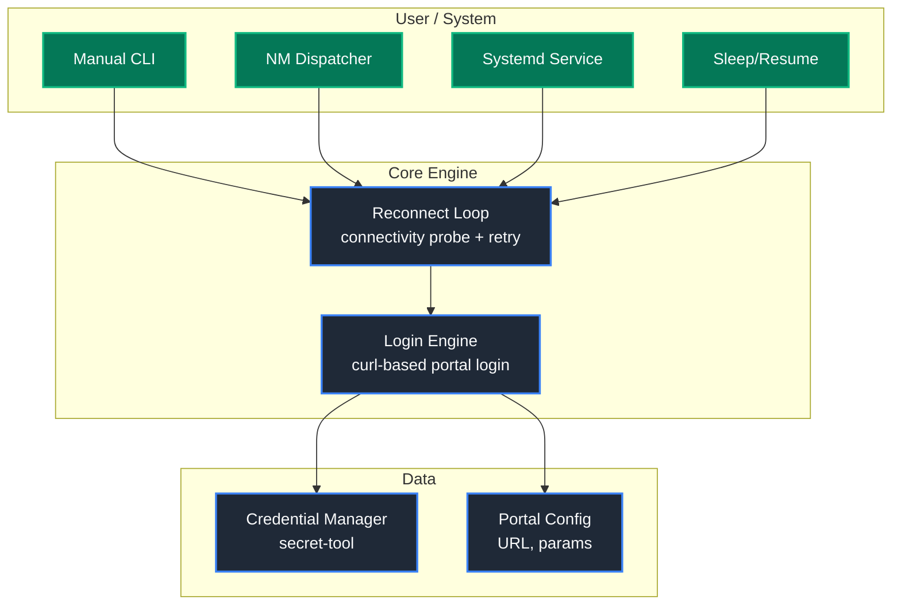

# Captivity — Architecture

## Overview

Captivity is an autonomous captive portal login client. The architecture is designed to evolve incrementally from shell scripts (v0.1–v0.5) through a Python core (v0.6–v1.9) to a Rust networking daemon (v2.0).

## Current Architecture (v0.2–v0.5: Shell Phase)

## Module Responsibilities

| Module                  | File                           | Responsibility                              |
|-------------------------|--------------------------------|---------------------------------------------|
| Credential Manager      | `scripts/captivity-creds.sh`   | Store/retrieve/delete credentials securely   |
| Login Engine            | `scripts/captivity-login.sh`   | Authenticate against captive portals         |
| Reconnect Loop          | `scripts/captivity-reconnect.sh` | Probe connectivity, retry login            |
| NM Dispatcher           | `scripts/captivity-dispatcher.sh` | Trigger login on WiFi events             |
| Systemd Service         | `systemd/captivity.service`    | Run as background daemon                     |
| Legacy Script           | `login.sh`                     | Original v0.1 script (preserved)             |

## Design Principles

1. **Modular**: Each module has a single responsibility
2. **Lightweight**: Minimal dependencies (curl, bash, secret-tool)
3. **Event-driven**: Prefer NM dispatcher events over polling
4. **Secure**: No plaintext credentials; use Linux Secret Service
5. **Backward-compatible**: Original login.sh always works

## Future Architecture (v0.6+)

The Python rewrite (v0.6) will introduce:
- Python package structure with CLI entry points
- Plugin system for different portal types
- DBus event listener for NetworkManager
- Connection state machine
- Telemetry and monitoring

The Rust core (v2.0) will handle:
- Network monitoring and portal detection
- High-performance event handling
- Target: <10MB memory usage
