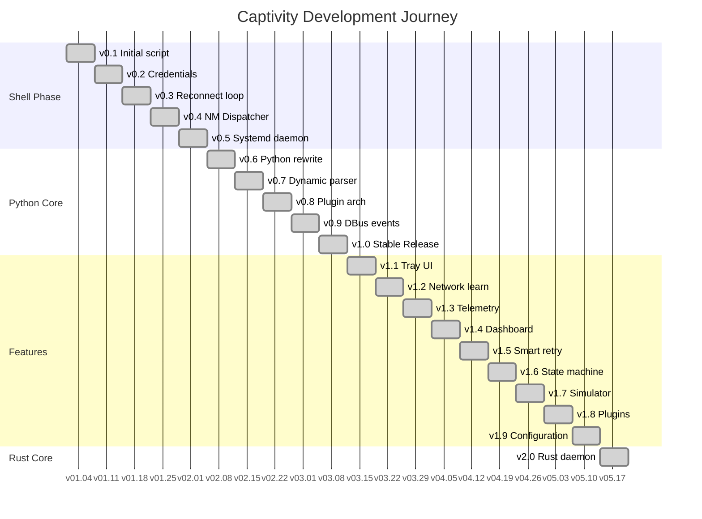

# 🗺️ Captivity — Development Timeline

## 🎯 Version Roadmap

## Release History

### v2.0 — 2026-03-24
- Rust daemon: probe.rs, monitor.rs, ipc.rs, main.rs
- Python bridge, `captivity daemon-rs` CLI
- 428 total tests (377 Python + 40 shell + 11 Rust)

### v1.9 — 2026-03-23
- Layered config: defaults → TOML file → env vars
- 8 typed sections, CLI show/get/set/init/reset
- 401 total tests (361 Python + 40 shell)

### v1.8 — 2026-03-23
- Plugin marketplace with 6 community plugin catalog
- Local registry, search, pip install/uninstall
- Enhanced CLI with search/install/uninstall/info
- 367 total tests (327 Python + 40 shell)

### v1.7 — 2026-03-23
- Portal simulator with 9 built-in scenarios
- Login, redirect, session expiry, rate limiting emulation
- `captivity simulate` CLI subcommand
- 337 total tests (297 Python + 40 shell)

### v1.6 — 2026-03-23
- Enhanced state machine: RETRY_WAIT state, transition history
- State duration tracking, retry engine integration
- Event bus auto-publishing on transitions
- 311 total tests (271 Python + 40 shell)

### v1.5 — 2026-03-23
- Smart retry engine with exponential backoff + jitter
- Failure classification (transient/auth/rate-limited/portal-down)
- Circuit breaker with auto-reset
- 311 total tests (271 Python + 40 shell)

### v1.4 — 2026-03-23
- Local web dashboard at `http://localhost:8787`
- Dark-theme SPA with auto-refresh (5s)
- JSON API: status, stats, history, networks, bandwidth
- `captivity dashboard` CLI command
- 287 total tests (247 Python + 40 shell)

### v1.3 — 2026-03-23
- WiFi session uptime tracking
- Bandwidth monitoring (/proc/net/dev)
- Persistent connection statistics database
- `captivity stats` CLI command
- 269 total tests (229 Python + 40 shell)

### v1.2 — 2026-03-23
- Network fingerprinting (gateway, portal domain, content hash)
- Persistent network profile database with auto-learning
- `captivity learn` CLI command (list/show/forget)
- 218 total tests (178 Python + 40 shell)

### v1.1 — 2026-03-16
- GTK3 system tray icon with event-driven status
- Desktop notifications via notify-send
- `captivity tray` CLI command
- 177 total tests (137 Python + 40 shell)

### v1.0 — 2026-03-16
- Connection state machine (7 states)
- Plugin-based login with cache fast-path
- Event-driven daemon (bus + DBus + state machine)
- Auto WiFi SSID detection, `captivity networks` CLI
- 154 total tests (114 Python + 40 shell)

### v0.9 — 2026-03-16
- Thread-safe event bus with subscribe/publish
- NetworkManager DBus monitor (busctl/nmcli)
- 22 new tests (events + dbus_monitor)

### v0.8 — 2026-03-16
- Plugin base class, Pronto + Generic plugins
- Priority-based loader with entry_points support
- 19 new tests

### v0.7 — 2026-03-16
- Dynamic HTML form parser for arbitrary portals
- Portal endpoint cache with 7-day TTL
- 25 new tests (parser + cache)

### v0.6 — 2026-03-16
- Python package structure with `src/captivity/`
- Connectivity probe, credential wrapper, login engine in Python
- CLI: `captivity login|probe|status|daemon|creds`
- 34 Python tests passing

### v0.5 — 2026-03-16
- Systemd service unit with security hardening
- Auto-restart on failure, journal logging
- Service installer with enable/start/uninstall

### v0.4 — 2026-03-16
- NetworkManager dispatcher integration
- Auto-login on WiFi connect and connectivity changes
- Installer with config template

### v0.3 — 2026-03-16
- Automatic reconnect loop with connectivity probing
- Exponential backoff retry (5s → 300s)
- Single probe and daemon modes

### v0.2 — 2026-03-16
- Secure credential storage via `secret-tool`
- Enhanced login script with CLI flags
- Test suite and documentation

### v0.1 — Initial Release
- Pronto Networks captive portal login via `curl`
- Basic connectivity verification
